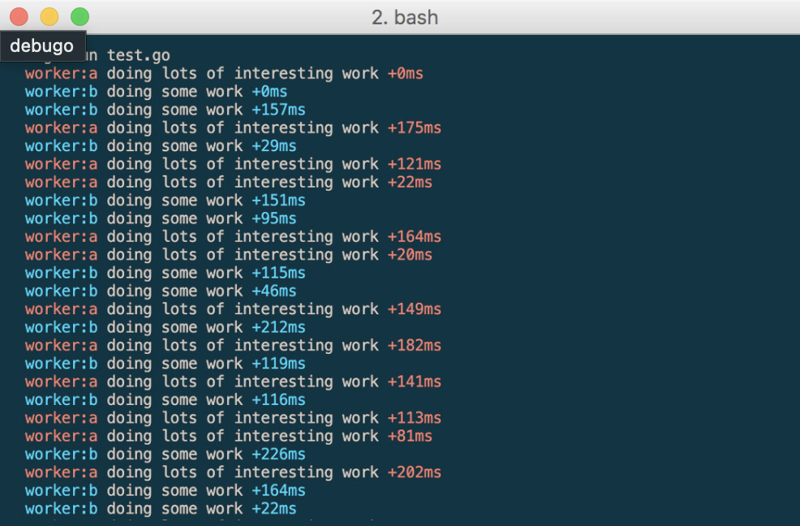

# debugo

<p align="center">
  
</p>

[](https://coveralls.io/github/YoSev/debugo?branch=main)

A lightweight, colorful, and flexible debugging utility for Go — inspired by [debug](https://github.com/debug-js/debug) in Node.js.

`debugo` provides namespaced, timestamped, and color-coded logging with support for inclusion/exclusion patterns and pluggable output streams.

---

## ✨ Features

- ✅ Namespaced debug logs (`namespace:subspace`)
- 🎨 Automatic and consistent color assignment per namespace
- 🕒 Time elapsed since last log (e.g., `+3ms`)
- 🧪 Wildcard-based inclusion/exclusion filtering (`*`, '?', `-namespace:*`)
- 🔐 Thread-safe logging with `sync.RWMutex`
- 🧰 Custom timestamp format and output writer support

---

## 📦 Installation

```bash
go get github.com/yosev/debugo
```

---

## 🚀 Quick Start

```go
package main

import (
	"github.com/yosev/debugo"
)

func main() {
	debugo.SetNamespace("*") // Enable all logs

	log := debugo.New("app")
	log.Debug("Hello, debugo!")

	sublog := log.Extend("submodule")
	sublog.Debug("Detailed submodule log")
}
```

### Output

```text
15:04:05.123 app Hello, debugo! +0ms
15:04:05.123 app:submodule Detailed submodule log +1ms
```

---

## 🧩 API Reference

### Logger Creation

| Function              | Description                              |
| --------------------- | ---------------------------------------- |
| `New(name string)`    | Creates a new debugger for the namespace |
| `Extend(name string)` | Creates a sub-namespace logger           |

### Logging Methods

| Method                | Description                        |
| --------------------- | ---------------------------------- |
| `Debug(args ...any)`  | Print values to the output stream  |
| `Debugf(format, ...)` | Formatted output like `fmt.Printf` |

---

## ⚙️ Configuration

### Enable/Disable Namespaces

```go
debugo.SetNamespace("*")                      // Enable all namespaces
debugo.SetNamespace("api:*")                  // Enable 'api' with sub spaces
debugo.SetNamespace("api:*, -api:auth")       // Enable `api:*` with sub spaces except `api:auth`
debugo.SetNamespace("api:?") 						      // Enable `api` with optional with sub spaces
debugo.SetNamespace("")                       // Disable all logging
```

Supports wildcards (`*`), optional sub spcaces (`?`), and negation (`-`).

### Output Stream

```go
f, _ := os.Create("debug.log")
debugo.SetOutput(f) // Send logs to a file instead of stdout
```

You can also set it back to `os.Stdout` or `os.Stderr` as needed.

### Timestamp Format

```go
debugo.SetTimestamp(&debugo.Timestamp{
	Format: "15:04:05", // HH:MM:SS (default)
})
```

Use any Go-compliant time format layout.

---

## ✅ Testing

```bash
go test -v -race ./...
```

If using `make`:

```bash
make test
```

---

## 📁 Project Structure

```
debugo/
├── debugo.go      // main library
├── color.go       // color functions
├── runtime.go     // global runtime configuration
├── namespace.go   // namespace functions
├── time.go        // timestamp functions
└── write.go       // output writer
```

---

## 🤝 Contributing

Contributions are very welcome!

- Fork this repo
- Create a new branch: `git checkout -b feature-name`
- Make changes and commit: `git commit -am 'Add feature'`
- Push: `git push origin feature-name`
- Create a pull request

---

## 📄 License

MIT License © 2025 [YoSev](mailto:yo@sev.wtf)
